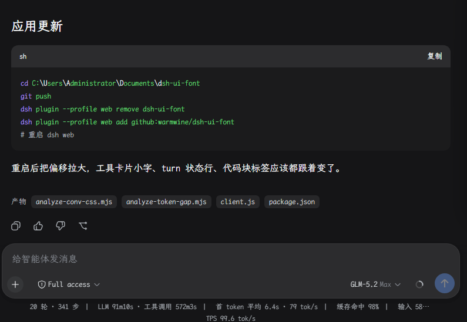
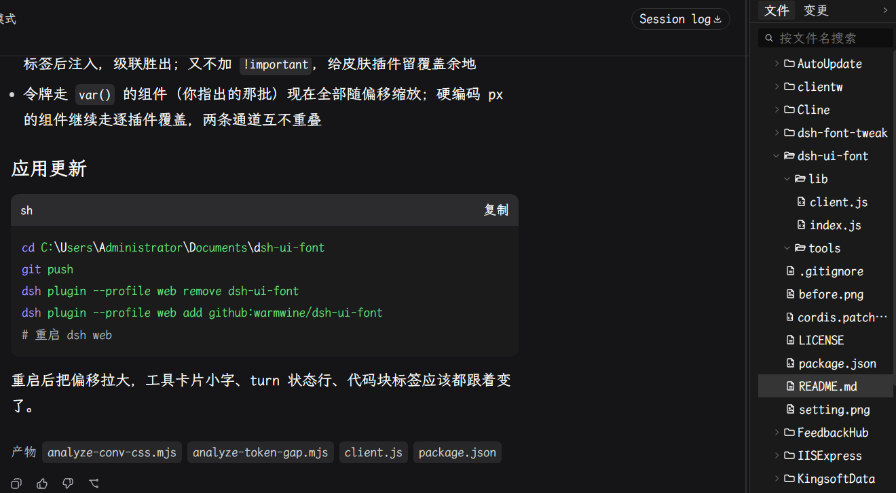
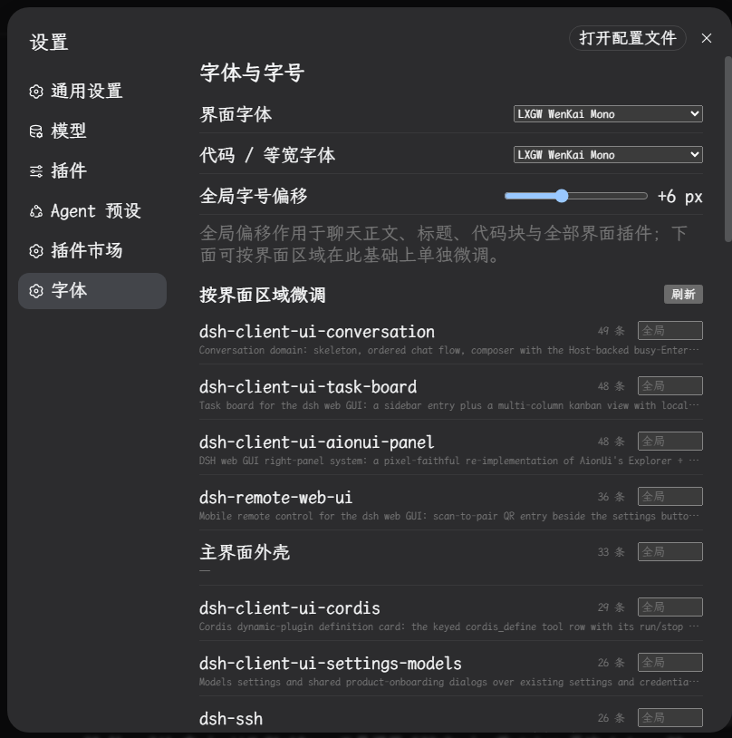

# dsh-ui-font

DSH Web GUI 的字体引擎 + 设置页微型插件。**运行时自动发现所有界面插件与系统字体**并套用字体设置，dsh 本体零改动。

## 效果

| 安装前 | 安装后 |
| :---: | :---: |
|  |  |

设置界面（侧边栏 → 设置 → 字体）：



## 使用

侧边栏 → 设置 → **「字体」**：

- **界面字体** / **代码字体**：从**系统已安装字体**中选取（宿主半边解析字体文件
  name 表枚举，列表随系统实时变化；未安装的当前值显示"（未安装）"标记）
- **全局字号偏移**：-3 ~ +20px 滑杆，即时生效（作用令牌 + 全部扫描到的硬编码字号）
- **按界面区域微调**：列出运行时发现的每个界面插件，附**描述**（取自各包
  package.json 的 description，缺失时回退 README 首个标题），可单独叠加偏移
- **刷新**：手动重扫页面样式 + 重新拉取描述与字体列表。无轮询、无 MutationObserver——
  启动时同步扫描一次，随后 1s/3s/8s 各补扫一次（覆盖惰性注入的插件样式，
  有界收敛、之后完全静止），此后只在打开设置页和点刷新时扫描
- 设置存 localStorage（键 `dsh.uiFont.v1`），刷新/重启后保留

## 工作原理（发现机制）

页面本身就是注册表：

1. 每个客户端插件的 CSS 以 `<style data-plugin="<插件id>">` 标签注入 —— 遍历
   `document.styleSheets`，按 owner 归属分组，即得到全部插件的硬编码字号规则
2. dsh 外壳的 `<link>` 样式表是 `--dsw-font-*` 令牌的"库存值"来源，运行时读取并按 delta 缩放重写
3. 描述与系统字体列表由宿主半边提供：`POST /api/dsh-ui-font/descriptions`、
   `GET /api/dsh-ui-font/fonts`（枚举系统字体 = 解析字体文件 sfnt name 表，
   纯 fs 无子进程；引擎对"有哪些插件/字体"零先验知识，全部运行时发现）

## 目录

```
dsh-ui-font/
├── package.json       # dsh.bundle + dsh.client 声明（platform: web）
├── cordis.patch.yml   # bundle 层插入行（ui-font）
├── lib/index.js       # 宿主半边：描述 + 字体枚举路由（webServer）
├── lib/client.js      # 浏览器半边：扫描引擎 + 令牌重写 + 设置页（settings.section）
└── images/            # README 截图（不随 npm 包分发）
```

## 安装 / 卸载

```sh
# 安装（npm 发布后）
dsh plugin --profile web add dsh-ui-font
# 或本地开发
dsh plugin --profile web add link:<本仓库路径>

# 卸载
dsh plugin --profile web remove dsh-ui-font
```

安装/卸载后重启 `dsh web`。本插件零 bundled 依赖（宿主半边只用 Node 内置模块，
浏览器半边只依赖平台提供的 react），安装无需构建授权。

插件不捆绑字体文件；所选字体缺失时自动回退系统默认字体栈。

## 已知边界

- dsh-ssh 的 xterm Web 终端保持其内置字体（选择器含 `xterm` 的规则被显式跳过）
- 皮肤插件（qq98 等）激活时会整体覆盖字体变量，以皮肤为准

## License

MIT
